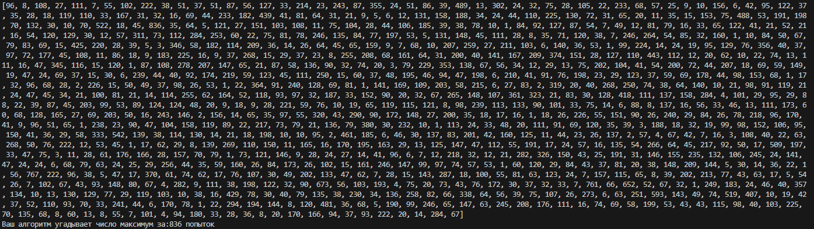

# Project 0. Guess the number

## Contents
[1. Project description](README.md#Project-description)  
[2. What case are we solving?](README.md#What-case-are-we-solving)  
[3. Brief information about the data](README.md#Data-Brief)  
[4. Stages of work on the project](README.md#Stages-of-work-on-the-project)  
[5. Results](README.md#Results)  
[6. Conclusions](README.md#Conclusions)  

### Project description
Guess the hidden computer number using the minimum number of attempts.

:arrow_up:[to contents](README.md#Contents)


### What case are we solving?
You need to write a program that guess a number in a minimum number of attempts.

**Conditions of the competition:**
- The computer gives a number from 0 to 100, and we need to guess it. By “guess” we mean “write a program that guesses a number.”
- The observation algorithm provides information about whether the random number is greater or less than what we need.
- Number of attempts should not be bigger than 20.  

**Quality Metric**
The results are compared by the average value of the results over 1000 repetitions

**What we practice**
- Learning to write good code in *Python*
- Practice to work with *IDE*
- Practice to work with *GitHup*


### Data Brief
We are using code in file game_v3.py to find more effective algorithm. 
  
:arrow_up:[to contents](README.md#Contents)


### Stages of work on the project
- [x] Analyze exist algorithm
- [x] Try different approaches to improve it
- [x] By results choose the right solution


:arrow_up:[to contents](README.md#Contents)


### Results:
Before:


After:
```
List of Attempts for each selected number: [7, 6, 3, 7, 7, 5, 6, 5, 4, 4, 7, 7, 6, 6, 4, 5, 7, 5, 6, 6, 6, 4, 7, 7, 6, 6, 7, 6, 7, 7, 7, 6, 4, 5, 6, 4, 7, 3, 7, 5, 6, 5, 6, 7, 5, 7, 6, 7, 4, 6, 3, 4, 6, 4, 6, 6, 6, 5, 7, 5, 7, 6, 7, 7, 6, 5, 5, 6, 6, 7, 6, 7, 4, 6, 5, 6, 2, 7, 6, 7, 7, 7, 4, 5, 6, 6, 7, 6, 7, 7, 7, 5, 5, 5, 7, 6, 6, 6, 4, 6, 5, 7, 7, 7, 6, 7, 6, 7, 7, 7, 5, 7, 5, 1, 6, 7, 7, 7, 7, 6, 5, 6, 6, 5, 5, 7, 5, 1, 7, 7, 3, 7, 5, 7, 7, 6, 6, 6, 5, 6, 7, 6, 5, 7, 7, 7, 5, 5, 5, 7, 6, 5, 6, 6, 2, 7, 6, 7, 6, 7, 7, 6, 6, 6, 5, 5, 6, 6, 5, 3, 7, 7, 6, 7, 7, 7, 2, 5, 5, 7, 7, 6, 5, 7, 5, 6, 6, 6, 3, 7, 3, 7, 3, 6, 6, 4, 5, 7, 7, 7, 7, 7, 5, 6, 6, 6, 7, 4, 6, 2, 7, 7, 6, 7, 7, 7, 6, 7, 7, 4, 6, 5, 6, 5, 5, 5, 6, 5, 4, 7, 7, 5, 6, 6, 7, 5, 4, 6, 7, 6, 7, 5, 7, 4, 7, 6, 7, 5, 7, 6, 7, 4, 6, 6, 4, 6, 7, 7, 6, 6, 7, 7, 5, 7, 6, 5, 7, 6, 2, 6, 5, 6, 4, 7, 4, 3, 3, 4, 7, 5, 7, 3, 7, 5, 2, 6, 6, 6, 5, 6, 6, 4, 5, 7, 6, 6, 7, 5, 6, 7, 7, 7, 7, 5, 7, 5, 7, 6, 7, 5, 7, 6, 4, 4, 6, 5, 6, 5, 7, 6, 6, 6, 5, 7, 6, 5, 7, 7, 4, 5, 2, 6, 5, 7, 7, 4, 7, 5, 7, 2, 7, 6, 7, 4, 4, 3, 6, 6, 5, 7, 4, 7, 3, 7, 5, 7, 5, 6, 7, 6, 6, 4, 6, 6, 7, 5, 7, 7, 7, 5, 7, 5, 7, 5, 3, 7, 6, 6, 2, 7, 4, 7, 7, 6, 4, 7, 6, 5, 6, 7, 5, 6, 5, 6, 7, 7, 4, 7, 4, 1, 5, 6, 7, 7, 6, 6, 7, 6, 6, 3, 3, 4, 6, 6, 6, 6, 6, 5, 6, 7, 3, 6, 4, 7, 7, 7, 5, 5, 5, 6, 6, 5, 5, 5, 5, 7, 4, 3, 6, 7, 5, 6, 6, 5, 6, 7, 7, 6, 6, 7, 5, 6, 7, 5, 6, 5, 7, 5, 5, 6, 4, 7, 7, 6, 7, 1, 7, 7, 7, 7, 7, 7, 6, 7, 6, 6, 4, 7, 7, 7, 5, 6, 5, 4, 7, 5, 5, 6, 6, 6, 7, 5, 6, 4, 7, 6, 4, 7, 5, 7, 6, 5, 6, 5, 7, 7, 7, 3, 6, 7, 6, 7, 4, 7, 6, 5, 7, 7, 3, 7, 7, 7, 6, 6, 7, 3, 6, 4, 7, 7, 7, 6, 7, 5, 7, 7, 4, 7, 6, 6, 6, 6, 7, 7, 6, 6, 4, 7, 2, 3, 6, 5, 1, 6, 6, 7, 7, 6, 6, 7, 7, 6, 3, 6, 6, 6, 6, 7, 5, 5, 7, 7, 7, 7, 6, 6, 7, 6, 7, 2, 6, 5, 7, 6, 6, 6, 5, 5, 2, 7, 6, 6, 7, 7, 6, 5, 7, 7, 2, 5, 7, 4, 7, 7, 5, 6, 4, 4, 3, 7, 7, 6, 6, 4, 6, 7, 4, 7, 7, 6, 5, 5, 7, 7, 5, 6, 4, 7, 5, 6, 6, 7, 6, 6, 1, 7, 7, 7, 7, 7, 7, 5, 7, 6, 7, 7, 5, 6, 6, 7, 6, 5, 7, 7, 4, 6, 7, 6, 3, 5, 1, 7, 5, 6, 7, 7, 6, 7, 7, 6, 7, 7, 7, 7, 6, 3, 6, 7, 7, 7, 6, 5, 4, 6, 7, 6, 6, 6, 6, 3, 7, 6, 5, 6, 5, 7, 7, 7, 4, 6, 6, 7, 6, 4, 7, 4, 5, 4, 6, 5, 7, 7, 6, 5, 6, 7, 7, 6, 7, 4, 5, 7, 6, 5, 7, 6, 7, 7, 6, 7, 4, 7, 7, 5, 3, 7, 5, 7, 5, 6, 5, 5, 7, 7, 2, 7, 6, 6, 4, 3, 6, 7, 7, 5, 6, 7, 6, 7, 7, 6, 7, 6, 5, 6, 6, 7, 4, 5, 7, 4, 7, 4, 7, 7, 7, 7, 6, 7, 7, 6, 6, 7, 7, 7, 6, 3, 7, 7, 3, 5, 7, 5, 7, 3, 3, 7, 7, 5, 6, 7, 7, 6, 6, 5, 7, 5, 6, 6, 7, 7, 6, 5, 7, 5, 5, 7, 5, 3, 6, 6, 5, 6, 7, 4, 7, 6, 4, 6, 6, 6, 6, 6, 6, 5, 6, 6, 7, 6, 6, 7, 4, 7, 7, 7, 5, 7, 6, 6, 7, 7, 6, 6, 4, 7, 4, 7, 6, 6, 6, 7, 7, 6, 4, 6, 6, 7, 7, 7, 7, 4, 6, 7, 6, 7, 6, 7, 7, 5, 4, 7, 6, 7, 3, 4, 4, 5, 6, 6, 7, 4, 7, 7, 4, 7, 6, 7, 4, 7, 7, 7, 7, 6, 7, 2, 5, 6, 4, 6, 6, 7, 7, 6, 7, 4, 7, 6, 6, 5, 5, 7, 7, 5, 6, 6, 6, 7, 7, 2, 2, 7, 3, 7, 4, 7, 7, 4, 3, 6, 6, 7, 6, 4, 6, 6, 5, 6, 6, 6, 6, 7, 7, 7, 7, 6, 6, 7, 7, 6, 7, 5, 4, 6, 6, 6, 5, 6, 6, 5, 6, 5, 5, 7, 7, 7, 6, 6, 6, 7, 7, 7, 6, 6, 5, 5, 7, 6, 7, 7, 5, 7, 6, 3, 6, 6, 7, 7, 6, 7, 7, 6]
Algorithm had found selected numbers in maximum :7 attempts
```

:arrow_up:[to contents](README.md#Contents)


### Conclusions:
No limits for perfection.

:arrow_up:[to contents](README.md#Contents)


If the information on this project seems interesting or useful to you, then I will be very grateful to you if you mark the repositories and profile with ⭐️⭐️⭐️
